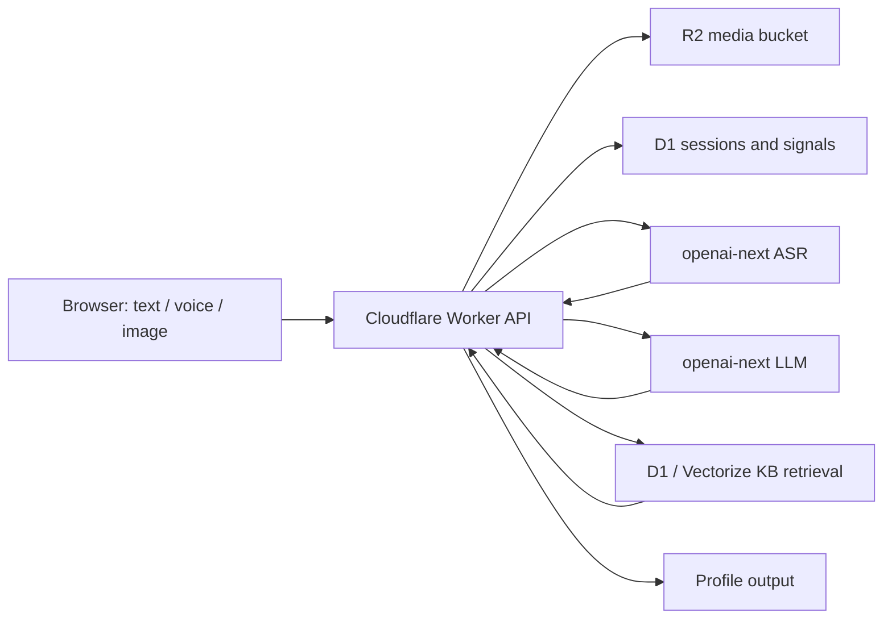

# Cloudflare Deployment Plan

## Goal

Deploy the multimodal four-dimensional profile system without exposing API keys in the browser.

The target product flow is:



## What We Borrow From awesome-cloudflare

`zhuima/awesome-cloudflare` is a catalog, not a deployable framework. The useful pattern is repeated across many projects:

- Media products use `Workers + R2`, often with D1 for metadata.
- Small SaaS/admin tools use `Workers + Hono + D1`.
- Larger content or AI systems use `Pages/Workers + D1 + KV + R2 + Vectorize`.
- LLM gateway projects use Workers or Durable Objects for rate limit, cost tracking, and provider routing.

For this repository, the best fit is:

```text
Cloudflare Worker Static Assets or Pages
Cloudflare Worker API
R2 for raw media
D1 for sessions, signals, profile outputs, audit logs
Vectorize later for semantic KB retrieval
openai-next for ASR, vision, and profile generation
```

## Recommended Architecture

### Frontend

Use Cloudflare Workers Static Assets or Cloudflare Pages.

Initial deploy can serve `demo-phaser-iso/index.html` as a static page. When the product UI becomes a real app, move to:

```text
apps/web        Vite + Phaser/React or Phaser-only UI
workers/api     Hono Worker API
```

The frontend must never receive `OPENAI_NEXT_API_KEY`.

### Worker API

The Worker is the backend-for-frontend. Suggested routes:

| Route | Purpose |
|---|---|
| `POST /api/sessions` | Create first-session intake state |
| `POST /api/sessions/:id/text` | Store typed text and extract text signals |
| `POST /api/sessions/:id/media` | Accept small voice/image uploads and store them in R2 |
| `POST /api/sessions/:id/asr` | Transcribe voice through openai-next and create voice signals |
| `POST /api/sessions/:id/image-signals` | Extract tongue/face/palm observations through vision LLM |
| `POST /api/sessions/:id/profile` | Retrieve KB evidence and generate four dimensions + current state |
| `GET /api/sessions/:id` | Return collection coverage, next question, and latest profile |

For long-running profile generation, return `202 Accepted` and push a job to Cloudflare Queues. Poll with `GET /api/sessions/:id`.

### R2

R2 stores uploaded voice and image files:

```text
r2://0704hks-media/{session_id}/{input_id}.{ext}
```

Keep retention short for raw biometric-like images and voice. Store extracted signals and quality metadata in D1; delete raw media after the configured retention window unless the user explicitly saves it.

### D1

D1 stores operational state:

```sql
sessions(id, created_at, goal, status, skipped_categories_json)
raw_inputs(id, session_id, modality, source_uri, mime_type, quality_json, created_at)
signals(id, session_id, modality, type, value, confidence, dimension_hint_json, payload_json, created_at)
profile_outputs(id, session_id, output_json, created_at)
kb_chunks(id, domain, tags_json, text, source_json, safety_json)
audit_events(id, session_id, kind, payload_json, created_at)
```

The current local `knowledge-base/index/kb.sqlite` is good for development, but do not ship that SQLite file directly to Workers. For Cloudflare, export chunks from `knowledge-base/chunks/*.jsonl` into D1 and later into Vectorize.

### KB Retrieval

MVP:

- Put `knowledge-base/chunks/*.jsonl` into D1.
- Retrieve by dimension, tags, and keyword matches.
- Pass only short evidence chunks into the LLM.

Next version:

- Generate embeddings for chunks.
- Store vectors in Cloudflare Vectorize.
- Use D1 for chunk metadata and source text.
- Query Vectorize first, then hydrate chunk text from D1.

### AI Calls

Keep using openai-next behind the Worker:

```text
ASR: gpt-4o-transcribe -> fallback whisper-1
Vision/text/profile: claude-sonnet-5 by default
Visual backup: qwen3-vl-plus
```

Secrets:

```bash
wrangler secret put OPENAI_NEXT_API_KEY
wrangler secret put APP_ACCESS_TOKEN
```

Vars:

```toml
[vars]
OPENAI_NEXT_BASE_URL = "https://api.openai-next.com"
OPENAI_NEXT_MODEL = "claude-sonnet-5"
OPENAI_NEXT_ASR_MODELS = "gpt-4o-transcribe,whisper-1"
OPENAI_NEXT_ASR_LANGUAGE = "zh"
OPENAI_NEXT_ASR_MAX_AUDIO_MB = "24"
MEDIA_MAX_IMAGE_MB = "10"
```

`APP_ACCESS_TOKEN` protects routes that write data or call paid upstream AI. Clients must send it as:

```text
Authorization: Bearer <token>
```

or:

```text
X-0704HKS-Access-Token: <token>
```

Do not deploy public ASR, LLM, media upload, or session-writing routes without this secret or a stronger auth layer.

## Minimal wrangler Shape

Use this as a starting shape, not a final checked-in secret file:

```toml
name = "0704hks"
main = "workers/api/src/index.ts"
compatibility_date = "2026-07-01"
workers_dev = true

[assets]
directory = "./demo-phaser-iso"
binding = "ASSETS"

[vars]
OPENAI_NEXT_BASE_URL = "https://api.openai-next.com"
OPENAI_NEXT_MODEL = "claude-sonnet-5"
OPENAI_NEXT_ASR_MODELS = "gpt-4o-transcribe,whisper-1"
OPENAI_NEXT_ASR_LANGUAGE = "zh"
OPENAI_NEXT_ASR_MAX_AUDIO_MB = "24"

[[r2_buckets]]
binding = "MEDIA"
bucket_name = "0704hks-media"

[[d1_databases]]
binding = "DB"
database_name = "0704hks"
database_id = "<fill-after-create>"

[[vectorize]]
binding = "KB_VECTORIZE"
index_name = "0704hks-kb"
```

## Deployment Phases

### Phase 1: Fast Demo

Deploy the static prototype only:

```bash
wrangler deploy
```

This validates domain, CDN, and mobile loading. It does not call ASR or LLM.

### Phase 2: Worker API MVP

Add `workers/api` in TypeScript with Hono. Implement:

1. Session creation.
2. Voice/image upload to R2.
3. ASR proxy route.
4. D1 persistence of `RawInput` and `ProfileSignal`.
5. Collection gate: MBTI -> body -> bazi -> psychology.

At this stage, image and profile generation can call openai-next directly from the Worker. The Python scripts remain local fixtures and reference implementations.

### Phase 3: Profile Engine Port

Port the stable parts of `scripts/profile_engine.py` to TypeScript:

- collection coverage rules
- follow-up question merge
- evidence packing
- LLM JSON repair and normalization
- safety language

Keep Python `scripts/build_kb.py` as an offline build tool.

### Phase 4: KB Productionization

Move KB to Cloudflare storage:

1. Import `knowledge-base/chunks/*.jsonl` into D1.
2. Add a build script that generates migration/import files.
3. Add Vectorize for semantic retrieval after keyword retrieval feels too narrow.

### Phase 5: Hardening

Add:

- Turnstile on public upload routes.
- Per-session and per-IP rate limits.
- R2 lifecycle deletion for raw voice and face/tongue images.
- Audit logs for ASR/LLM calls, without storing API keys or raw headers.
- Queues for retryable ASR/profile jobs.
- Admin-only replay tooling for failed jobs.

## GitHub Integration

Recommended branch flow:

```text
main -> Cloudflare preview deploy
release/* -> production deploy
```

GitHub Actions can run:

```bash
python3 -m py_compile scripts/*.py
python3 -m json.tool examples/voice-transcription.example.json
python3 scripts/profile_engine.py examples/multimodal-intake.example.json --mode rules --pretty
npm test
wrangler deploy --dry-run
```

Cloudflare secrets should be configured in Cloudflare, not GitHub repository files.

## Decision

Use Cloudflare as the deployment center:

- Frontend: Workers Static Assets first, Pages only if the frontend team prefers Pages previews.
- Backend: Workers + Hono.
- Media: R2.
- State: D1.
- KB: D1 first, Vectorize later.
- AI: openai-next through Worker secrets.

This gives us multimodal support on GitHub/Cloudflare deployment because the browser only uploads files and reads results; all sensitive ASR, vision, KB retrieval, and profile generation runs on the backend.
