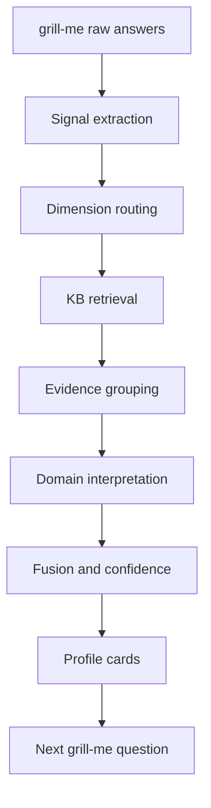

# Diagnosis Flow

## Naming

The team may use `diagnosis` internally as a shorthand for structured interpretation. User-facing language should use:

- `画像判断`
- `倾向评估`
- `四维解读`
- `调理建议`
- `参考结论`

Do not call the output medical diagnosis, clinical psychological diagnosis, official MBTI assessment, or deterministic fortune telling.

## Four-Dimensional Diagnosis Model

| Dimension | Main framework | What it reads | What it outputs |
|---|---|---|---|
| Body | TCM | physical tendency, sleep, digestion, cold/heat, fatigue | constitution tendency and wellness direction |
| Psychology | Adler individual psychology | motive, inferiority/compensation, life style, social interest, protective strategy | psychological pattern and follow-up question |
| Spirit | Xuanxue / Zi Ping | life-stage narrative, five-element metaphor, timing reflection | reflective life theme, not fate assertion |
| MBTI | MBTI-style preferences | information preference, decision preference, energy direction, closure style | interaction preference and relationship prompt |

The psychology dimension is now Adler-first. TCM `情志` can support body-emotion linkage, but it should not replace the psychological reading.

## End-To-End Flow



## grill-me Signal Extraction

grill-me should collect signals, not conclusions. A raw answer becomes structured fields:

Text, voice, and image inputs should first be normalized through `schemas/profile-signal.schema.json`. The detailed multimodal rules are in `docs/multimodal-input.md`.

Collection order is fixed:

```text
MBTI -> Body -> Ba Zi -> Psychology
```

Rules:

- The first session should stay around 30 seconds.
- The user must submit at least two information categories before a full four-dimensional profile is generated.
- The user can skip at most two categories.
- If two earlier categories have already been skipped, every later category becomes required.
- Missing Ba Zi is not the same as skipped Ba Zi. Mark it skipped only when the user explicitly skips it; otherwise keep it as the next collection step.
- Body can be submitted through a short answer, voice, tongue/face image, or hand image.
- Ba Zi means birth date/time; uncertain birth time should be marked as uncertain.
- Psychology comes last and should use 3-5 short Adler-style questions.

```json
{
  "goal": "想知道最近为什么总是拖延和内耗",
  "signals": [
    {
      "type": "repeated_pattern",
      "value": "重要任务前会拖延",
      "dimension_hint": ["psychology", "mbti"],
      "confidence": "high"
    },
    {
      "type": "self_evaluation",
      "value": "怕做不好被别人看低",
      "dimension_hint": ["psychology"],
      "confidence": "high"
    },
    {
      "type": "sleep",
      "value": "最近多梦",
      "dimension_hint": ["body"],
      "confidence": "medium"
    }
  ]
}
```

Good first-round signal types:

- `goal`: user goal or current concern.
- `body_state`: sleep, digestion, appetite, cold/heat, pain, fatigue.
- `emotion_state`: anxiety, anger, sadness, numbness, irritability.
- `repeated_pattern`: repeated behavior such as procrastination, control, pleasing, withdrawal.
- `self_evaluation`: not good enough, must prove self, fear of being judged.
- `relationship_pattern`: conflict, pleasing, cold treatment, dependence, boundary issue.
- `mbti_known`: known MBTI or preference clues.
- `birth_info`: birth date/time for Xuanxue only if user provides it.

## Psychology Dimension Reading

For the Adler psychology dimension, collect 3-5 short answers, then read signals in this order:

1. `What is the repeated pattern?`
2. `What does this pattern protect?`
3. `What psychological goal does it serve?`
4. `What life style or relationship script does it suggest?`
5. `What small action could test a new strategy?`

Example mapping:

| grill-me signal | Adler reading | Retrieval tags |
|---|---|---|
| “我总怕自己不够好” | inferiority feeling and self-worth protection | `自卑感`, `补偿`, `自尊保护` |
| “事情重要我就拖延” | safeguarding strategy against failure exposure | `防御策略`, `拖延`, `完美主义` |
| “我总想证明自己” | striving for importance or competence | `目标导向`, `重要感`, `补偿` |
| “关系里我经常讨好” | seeking safety through relationship position | `关系模式`, `归属感`, `共同体感觉` |
| “我从小就习惯负责” | possible life style and early role script | `生活风格`, `家庭氛围`, `早期经验` |

## Retrieval Logic

Use `knowledge-base/index/retrieval_policy.json` as the router:

```text
tcm_body:
  domains: tcm
  tags: 体质, 藏象, 气血津液, 病因, 病机, 治则

psychology:
  domains: psychology, tcm
  tags: 阿德勒, 自卑感, 补偿, 目标导向, 生活风格, 共同体感觉, 关系模式, 情志

xuanxue_spirit:
  domains: xuanxue
  tags: 四柱, 五行, 十神, 大运, 刑冲合会, 格局

mbti:
  domains: mbti
  tags: MBTI, 偏好维度, 16型人格
```

Retrieval should return evidence, not final text. Each result should keep:

- `id`
- `domain`
- `tags`
- `locator`
- `source`
- `text`
- `score`
- `safety`

## Profile Card Contract

Each dimension should output a card with evidence and confidence:

```json
{
  "dimension": "psychology",
  "title": "重要任务前的保护性拖延",
  "summary": "你描述的拖延不像单纯懒散，更像是在重要评价前保护自尊和胜任感。",
  "confidence": "medium",
  "signals": ["重要任务前拖延", "怕做不好被看低"],
  "evidence_chunk_ids": [
    "psychology_adler_inferiority_compensation",
    "psychology_adler_safeguarding"
  ],
  "interpretation": "从阿德勒心理框架看，这可能是一种降低失败暴露风险的保护策略。",
  "suggestion": "把任务拆成一个不会被评价的小动作，先验证自己能启动，而不是立刻追求完成。",
  "followup_question": "你拖延时更怕失败本身，还是更怕别人看到你失败？",
  "safety": "这不是临床心理诊断，只是基于当前信息的心理模式假设。"
}
```

## Fusion Rules

When multiple dimensions speak about the same signal:

- Body explains physical and lifestyle support.
- Psychology explains motive and protective strategy.
- Xuanxue provides reflective narrative and timing metaphor.
- MBTI explains preference and interaction style.

Do not force them into one answer. If they differ, say the frameworks are reading different layers.

Example:

```text
同样是“拖延”，心理维度会读作保护胜任感，MBTI 维度会读作开放式节奏或低闭环偏好，中医身体维度会检查睡眠和疲劳是否降低行动力。三者不是互相否定，而是在解释不同层面。
```

## Confidence

Use three levels:

- `high`: multiple strong signals, retrieved evidence aligns, no major contradiction.
- `medium`: enough signal for a first-pass reading, but missing one important field.
- `low`: input sparse, birth time uncertain, image signal weak, or evidence is broad.

Low confidence still returns a card, but it should include a sharper follow-up question.

## Safety

Hard stops:

- Self-harm or harm-to-others signals require safety escalation.
- Severe physical symptoms require medical guidance.
- Do not infer trauma from a single answer.
- Do not say a person is doomed, broken, pathological, or fixed.
- Do not use MBTI, psychology, TCM, or Xuanxue for high-stakes decisions.
