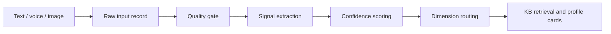

# Multimodal Input

## Goal

The input layer turns text, voice, and images into structured `ProfileSignal` objects. It should not produce a diagnosis directly.



The canonical schema is `schemas/profile-signal.schema.json`.

## Signal Contract

Every extracted signal must keep:

- `type`: what kind of signal it is, such as `sleep`, `repeated_pattern`, `tongue_observation`, or `mbti_known`.
- `value`: a short human-readable observation.
- `confidence`: `high`, `medium`, `low`, `unknown`, or `user_reported`.
- `dimension_hint`: one or more of `tcm_body`, `psychology`, `xuanxue_spirit`, `mbti`.
- `evidence`: references to the raw input, transcript span, image observation, user report, or KB chunk.
- `safety`: how the signal is allowed to be used and what it must not claim.

## Text Input

Text is the highest-trust user intent channel. Use it to extract:

- Current goal or main concern.
- Body state: sleep, appetite, digestion, cold/heat, pain, fatigue.
- Emotion state: anxiety, irritability, sadness, numbness, anger.
- Repeated pattern: procrastination, control, pleasing, withdrawal, overthinking.
- Self-evaluation: not good enough, fear of judgment, must prove self.
- Relationship pattern: conflict, boundary issue, dependence, cold treatment.
- MBTI or preference clues.
- Birth information, only if the user provides it.

Example:

```json
{
  "id": "sig_text_001",
  "modality": "text",
  "type": "repeated_pattern",
  "value": "重要任务前拖延",
  "raw_text": "我一遇到重要任务就拖延，怕做不好被别人看低。",
  "confidence": "high",
  "dimension_hint": ["psychology", "mbti"],
  "evidence": [
    {
      "kind": "transcript_span",
      "id": "input_text_001",
      "quote": "重要任务就拖延"
    }
  ],
  "safety": {
    "usage": "用于心理模式和互动偏好假设",
    "must_not": ["临床诊断", "人格定论"]
  }
}
```

## Voice Input

Voice has two layers:

```text
voice recording -> ASR transcript -> text signal extraction
voice delivery -> low-weight auxiliary signal
```

Current implementation:

- Use backend ASR, not direct audio chat. The frontend records or uploads audio, then sends the file to a server function.
- Default ASR route: OpenAI-compatible `POST /v1/audio/transcriptions` through `https://api.openai-next.com`.
- Default model order: `gpt-4o-transcribe`, then fallback to `whisper-1`.
- `gpt-4o-transcribe` is the preferred default because the smoke test returned cleaner simplified Chinese punctuation. `whisper-1` is the stable compatibility fallback.
- `gpt-4o-mini-transcribe` is not a default because the smoke test returned an upstream/model error.

Command:

```bash
export OPENAI_NEXT_API_KEY="your-api-key"
python3 scripts/transcribe_audio.py /path/to/voice.m4a --category body --pretty
```

The script emits a raw `input` object and a profile-ready voice `signal`. Append them to `intake.inputs` and `intake.signals`, then run `scripts/profile_engine.py`.

For persisted sessions, pass a stable storage URI instead of a local path:

```bash
python3 scripts/transcribe_audio.py /path/to/voice.m4a --source-uri r2://0704hks-uploads/session/input_voice_001.m4a --pretty
```

The script rejects unsupported audio formats and files larger than `OPENAI_NEXT_ASR_MAX_AUDIO_MB` before calling ASR. It does not include absolute local paths unless `--include-local-path` is explicitly set.

The transcript should be treated like text. Delivery features such as fast speech, long pauses, low volume, or hesitation can support a stress hypothesis, but they should not drive conclusions alone.

Voice delivery signal rules:

- Always mark delivery features as `low` or `medium` confidence.
- Never infer personality, mental disorder, honesty, or intent from voice alone.
- If audio quality is low, ask for repeat recording or typed text.

Example:

```json
{
  "id": "sig_voice_001",
  "modality": "voice",
  "type": "voice_delivery",
  "value": "语速偏快且停顿较多",
  "transcript": "最近睡不好，也很容易烦。",
  "transcript_confidence": "medium",
  "confidence": "low",
  "dimension_hint": ["psychology"],
  "delivery_features": [
    {
      "type": "speech_rate",
      "value": "fast",
      "confidence": "low",
      "usage_constraint": "仅作为压力状态辅助线索"
    }
  ],
  "evidence": [
    {
      "kind": "raw_input",
      "id": "input_voice_001"
    }
  ],
  "safety": {
    "usage": "辅助判断表达压力，不单独生成结论",
    "must_not": ["心理诊断", "人格判断", "真实性判断"]
  }
}
```

## Image Input

Images must pass a quality gate before domain extraction:

- Clarity: not blurred.
- Lighting: no strong yellow/blue cast.
- Angle: tongue, face, or palm is centered and usable.
- Occlusion: no mask, heavy shadow, cropped key area, or covering.
- Distance: subject is not too far or too close.

If quality is `unusable`, do not extract domain signals. Return a retry prompt.

### Tongue

Tongue images can support the TCM body dimension. Extract observations only:

- `tongue_body_color`
- `tongue_coating_color`
- `tongue_coating_thickness`
- `tongue_moisture`
- `tongue_shape`
- `tongue_teeth_marks`
- `tongue_cracks`

Do not output disease diagnosis, prescriptions, or efficacy promises.

Knowledge support now includes selected ancient tongue-diagnosis texts in the `tcm` domain: `临症验舌法` as the primary general source, plus `察舌辨症新法` and `伤寒舌鉴` as supplementary references. Use them to name visible tongue observations and uncertainty, not to diagnose from an image.

### Face

Face images can provide very weak body-state or reflective cues, but must avoid sensitive inferences. Extract only visible, low-risk observations such as complexion or under-eye state when quality allows.

Do not infer identity, age, gender, ethnicity, mental health diagnosis, attractiveness, or social status.

Knowledge support now includes `望诊遵经` as the primary face/color observation source and `形色外诊简摩` as supplementary external-observation material. Use them only for low-risk complexion and visible-state cues.

### Palm

Palm images should be routed mainly to `xuanxue_spirit` as reflective material. It can extract palm color, line visibility, and texture as observations, but outputs must stay non-deterministic.

Do not produce fate certainty, disaster claims, or high-stakes advice.

Example:

```json
{
  "id": "sig_image_001",
  "modality": "image",
  "type": "tongue_observation",
  "value": "舌体偏淡，白苔偏厚，疑似齿痕",
  "image_type": "tongue",
  "quality": {
    "status": "medium",
    "issues": ["color_cast"],
    "should_retry": false,
    "notes": "室内灯光略偏黄，颜色判断降置信度"
  },
  "observations": [
    {
      "type": "tongue_body_color",
      "value": "偏淡",
      "confidence": "medium"
    },
    {
      "type": "tongue_coating_thickness",
      "value": "偏厚",
      "confidence": "medium"
    },
    {
      "type": "tongue_teeth_marks",
      "value": "疑似齿痕",
      "confidence": "low"
    }
  ],
  "confidence": "medium",
  "dimension_hint": ["tcm_body"],
  "forbidden_inferences": [
    "identity",
    "age",
    "gender",
    "ethnicity",
    "disease_diagnosis",
    "mental_health_diagnosis",
    "fate_certainty",
    "high_stakes_decision"
  ],
  "evidence": [
    {
      "kind": "raw_input",
      "id": "input_image_001"
    }
  ],
  "safety": {
    "usage": "仅作体质倾向和调理参考",
    "must_not": ["医学诊断", "处方剂量", "疗效承诺"]
  }
}
```

## Fusion Weight

Default trust order:

| Source | Weight | Notes |
|---|---:|---|
| User text intent | High | Best for goals, subjective states, repeated patterns |
| Voice transcript | High | Same as text when ASR quality is good |
| User-reported MBTI or birth info | Medium | User-reported and may be uncertain |
| Tongue image observations | Medium | Quality-dependent and limited to TCM body reference |
| Voice delivery features | Low | Auxiliary only |
| Face and palm observations | Low to medium | Reflective or supportive, never deterministic |

Fusion rule:

```text
No conclusion may be stronger than its weakest critical signal.
```

If a conclusion depends on a low-quality image, the resulting profile card must be `low` or `medium` confidence and include a follow-up question or retry prompt.

## Extraction Prompt Shape

For any model or service doing extraction, use this order:

1. Identify raw input type and quality.
2. Extract observable facts only.
3. Convert facts to `ProfileSignal` objects.
4. Assign confidence and evidence.
5. Add safety constraints.
6. Route to dimensions.
7. Ask one follow-up if the key uncertainty blocks the profile.

Do not ask the extractor to produce a final four-dimensional profile.

## Retry Prompts

Use short operational retry prompts:

- Tongue: `请在自然光或白光下重拍舌头，舌面居中，避免滤镜和强黄光。`
- Face: `请正对镜头重拍，保持光线均匀，不要遮挡面部。`
- Palm: `请展开手掌重拍，掌心充满画面，避免阴影和模糊。`
- Voice: `这段语音噪声较重，可以重新录一遍，或直接打字告诉我最困扰你的点。`

## Safety Gate

Escalate before normal profile generation when any input mentions:

- Self-harm or harm to others.
- Severe chest pain, breathing difficulty, sudden neurological symptoms, or other urgent physical red flags.
- Requests for diagnosis, medication dosage, treatment replacement, disaster prediction, or high-stakes decision making.

After escalation, the normal four-dimensional profile can continue only if the user context is safe and the output stays within reflective guidance.
