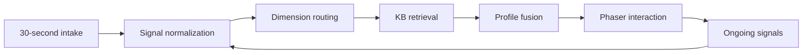
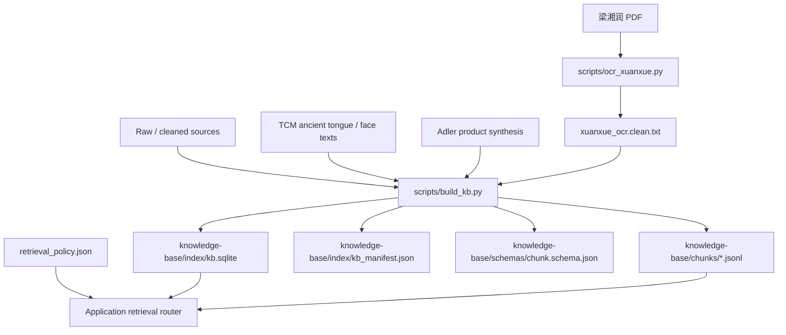
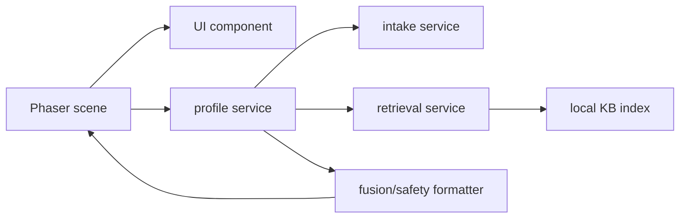

# Project Logic Overview

## Current Shape

This repository is the early product foundation for a four-dimensional profile system. The current assets split into two tracks:

- Knowledge base track: local source material, cleaned text, chunks, SQLite FTS index, and routing policy.
- Interaction track: a no-build Phaser 3 spike that validates the small isometric-world direction across collection, result, wellness, and social scene groups.

There is not yet a production app scaffold. The next step should connect these tracks through a small domain layer instead of letting Phaser scenes query files or SQLite directly.

## Product Loop

The intended first-session loop is:

1. Collect signals in order within about 30 seconds: MBTI, body, Ba Zi, then psychology.
2. Route the signal into one or more profile dimensions.
3. Retrieve supporting knowledge chunks by domain and tags.
4. Generate a first-pass profile with confidence and safety language.
5. Continue collecting signals during interactive wellness/social flows.
6. Refine the profile state over time.



## Four Dimensions

| Dimension | KB domain | Product role | Output style |
|---|---|---|---|
| TCM body | `tcm` | Constitution, physical tendency, lifestyle reference | Body tendency and wellness direction |
| Adler psychology | `psychology`, with `tcm` as body-emotion support | Psychological motive, repeated life style, social interest, relationship pattern | Mental pattern, protective strategy, and follow-up question |
| Xuanxue spirit | `xuanxue` | Zi Ping / Ba Zi cultural reflection | Life-stage narrative and reflective prompt |
| MBTI | `mbti` | Personality preference and relationship interaction | Interaction preference and growth prompt |

All dimensions should use language such as `倾向`, `画像`, `可能`, `参考`, and `调理方向`. They should not output medical diagnosis, official MBTI assessment results, deterministic fortune telling, or treatment instructions.

## Knowledge Base Flow

The current data pipeline is:



Important files:

- `scripts/ocr_xuanxue.py`: renders scanned PDF pages and runs Tesseract OCR for the Zi Ping source.
- `scripts/build_kb.py`: builds TCM, psychology, Xuanxue, and MBTI chunks, writes SQLite, schema, manifest, and KB README. TCM includes selected ancient diagnostic supplements for tongue diagnosis and face/color observation.
- `knowledge-base/index/retrieval_policy.json`: maps product dimensions to KB domains, tags, `top_k`, language guidance, and hard limits.
- `knowledge-base/index/kb.sqlite`: current keyword search index with FTS5 enabled.

## Runtime Module Boundary

The production app should keep rendering, domain logic, retrieval, and generation separate:

```text
src/
  scenes/             Phaser scenes and interaction state only
  domain/
    intake/           30-second collection, follow-up selection, signal normalization
    profile/          profile state, confidence, fusion, safety wording
    retrieval/        KB routing, SQLite/JSONL adapters, later embedding adapters
  ui/                 reusable cards, controls, overlays
  assets/             visual/audio assets
```

Suggested call direction:



Phaser should ask services for profile state and render it. It should not know how chunks are stored, how SQLite FTS works, or how safety limits are enforced.

## Data Contracts To Add Next

The next implementation pass should define these contracts before building many screens:

- `IntakeSignal`: raw user input plus type, source, timestamp, and optional confidence.
- `ProfileDimension`: one of `tcm_body`, `psychology`, `xuanxue_spirit`, `mbti`.
- `RetrievalQuery`: dimension, query text, optional tags, `top_k`, and safety mode.
- `RetrievedChunk`: chunk id, domain, tags, locator, source, text, and score.
- `ProfileCard`: title, summary, evidence chunks, confidence, follow-up question, and safety disclaimer.
- `ProfileState`: four dimension cards plus unresolved questions and accumulated signals.

## First-Session Logic

The first session should stay lightweight:

1. Ask MBTI/preference first.
2. Ask body second; accept text, voice, tongue/face image, or hand image.
3. Ask Ba Zi third; collect birth date/time and mark uncertainty if needed.
4. Ask psychology last with 3-5 short Adler-style questions.
5. Require at least two information categories before generating a full profile.
6. Let users skip at most two categories; once two earlier categories are skipped, all later categories are required.
7. Treat a category as skipped only after an explicit user skip action. Missing Ba Zi should stay as the next collection opportunity, not be inferred as skipped from later psychology text.
8. Store missing fields as future collection opportunities during interaction.

The current `retrieval_policy.json` encodes this rule in `first_session_30s`.

## Safety Logic

Safety should be enforced at two layers:

- Retrieval layer: choose domain-specific policy and expose hard limits with retrieved evidence.
- Generation/formatting layer: rewrite outputs into reflective language and block disallowed claims.

Key red lines:

- TCM: no diagnosis, prescriptions, dosage, efficacy promise, or emergency handling beyond advising medical care.
- Psychology: no clinical diagnosis, personality determinism, or trauma certainty; self-harm signals must escalate to safety guidance.
- Xuanxue: no disaster predictions, intimidation, paid ritual upsells, or replacement of real decisions.
- MBTI: no official-assessment claim, personality determinism, or high-stakes screening.

## Current Gaps

- No Vite + TypeScript + Phaser production scaffold yet.
- No typed domain services or runtime data contracts.
- No retrieval wrapper around SQLite/JSONL.
- No profile fusion logic that turns retrieved chunks into a structured card.
- No tests for KB build shape, retrieval behavior, or policy enforcement.
- OCR quality is usable as a first pass but should be reviewed before heavy product dependence.
- The Phaser spike uses hardcoded axis data and is not connected to the KB.

## Recommended Build Order

1. Add a TypeScript app scaffold with Phaser 3 pinned to the 3.x line.
2. Define shared domain contracts for signals, retrieval queries, chunks, profile cards, and profile state.
3. Implement a local retrieval adapter using `knowledge-base/index/kb.sqlite`.
4. Implement a policy router from `retrieval_policy.json`.
5. Build a deterministic profile-card formatter before adding any LLM generation.
6. Wire the existing scene-map interactions to real `ProfileCard`, intake, wellness, and social data.
7. Add smoke tests for KB counts, FTS search, policy routing, and first-session fallback behavior.
